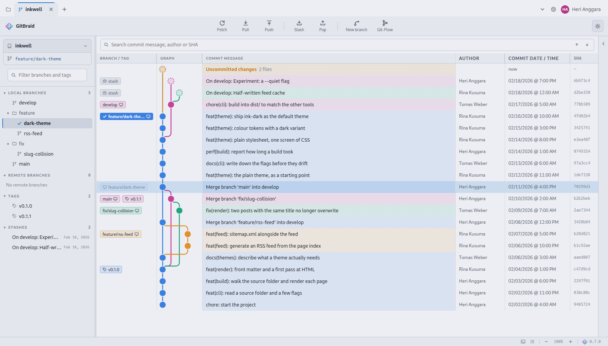
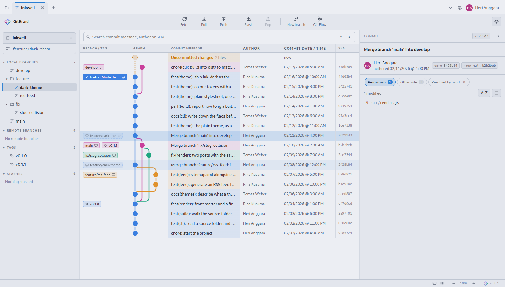
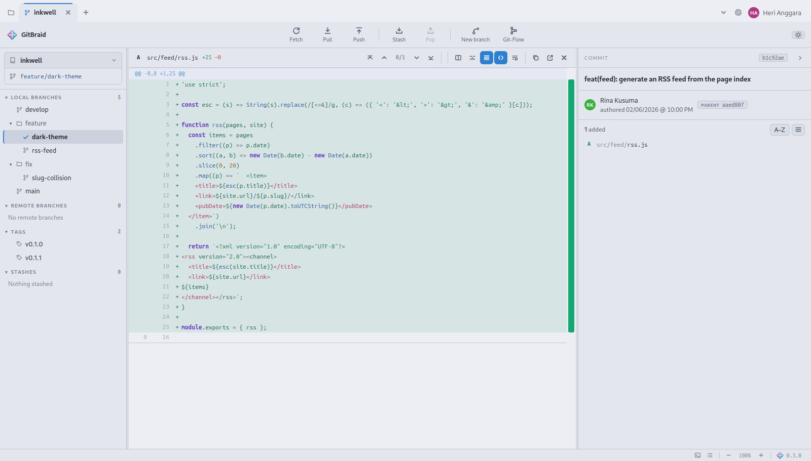
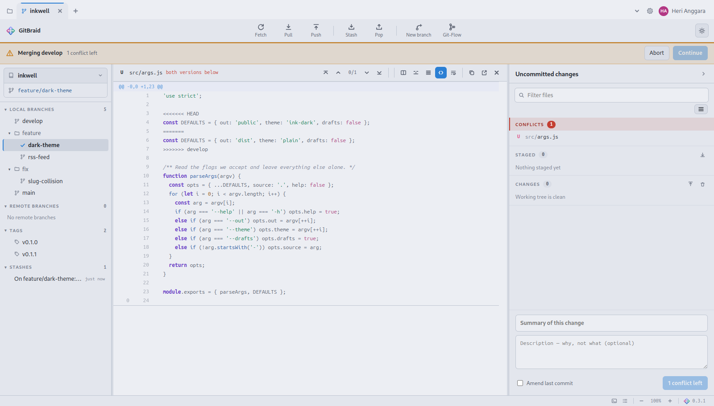

<div align="center">


# GitBraid

**Read your Git history as coloured lanes.**

A desktop Git client for Linux that drives the `git` already on your machine —
no daemon, no account, no telemetry. Built with Electron, and shipping *zero*
runtime dependencies.

[Download](#download) · [What it does](#what-it-does) · [Install](#install) ·
[Build from source](#build-from-source) · [Privacy](#privacy)

</div>

---

<div align="center">



</div>

---

## Download

Latest release: **v0.6.0**

| Platform | File | Notes |
|---|---|---|
| **Debian / Ubuntu** | [`gitbraid_0.6.0_amd64.deb`](https://github.com/heri-anggara/gitbraid/releases/download/v0.6.0/gitbraid_0.6.0_amd64.deb) | Installs into the applications menu |
| **Any Linux** | [`GitBraid-0.6.0.AppImage`](https://github.com/heri-anggara/gitbraid/releases/download/v0.6.0/GitBraid-0.6.0.AppImage) | One file, no install, updates itself |
| **Windows** | [`GitBraid Setup 0.6.0.exe`](https://github.com/heri-anggara/gitbraid/releases/download/v0.6.0/GitBraid.Setup.0.6.0.exe) | Unsigned — see the note below |

Older versions and full notes live on the [releases page](https://github.com/heri-anggara/gitbraid/releases).

> **About the Windows build.** It is produced from Linux and has not been tested
> on Windows. It is also unsigned, so SmartScreen will warn before it runs.
> Linux is the platform this is built for and used on; treat Windows as an
> experiment.

Once you are running 0.3.0 or newer, GitBraid checks for its own updates and can
install them for you — the version button in the status bar takes a dot when a
newer release exists, and **Help ▸ Check for Updates…** asks at any time.

---

## What it does

**The history, as a graph.** Branch lanes in colour, merges drawn as they
happened, tags and branch names in a column of their own, and the work you have
not committed yet sitting at the top of the branch. Only the rows on screen are
built, so a repository of nine thousand commits scrolls like one with nine.

Pick a commit and the panel beside it says what that commit did — and on a merge,
which side each file came from, since a merge has two parents and "what changed"
has more than one answer.

<div align="center">



</div>

**Diffs you can read.** Syntax colouring for eleven languages across some thirty
file extensions, written here rather than pulled from a library. Stage, unstage and discard by hunk. A
strip beside the scrollbar shows where every change is — click one to jump to
it.

<div align="center">



</div>

**Conflicts, shown as conflicts.** A merge that stops half-way says so across
the top, the conflicted file opens whole with its markers intact, and the commit
button counts what is left rather than pretending it can run.

<div align="center">



</div>

**Git-Flow, built in.** Start and finish features, releases and hotfixes without
the `git flow` binary installed. Finishing offers to push the result and to
remove the branch from the remote — and asks the remote whether it is really
there rather than trusting a tracking ref that may be stale.

**The rest.** Several repositories in tabs. Stashes. Cherry-pick, revert, reset.
Interactive rebase is *not* here — see [limitations](#known-limitations).
Commit search, file filtering, a terminal drawer, light and dark themes, and a
log of every `git` command it ran, so nothing it does is a mystery.

---

## Install

**Debian / Ubuntu**

```bash
sudo apt install ./gitbraid_0.6.0_amd64.deb
```

Then find GitBraid in your applications menu, or run `gitbraid`.

**AppImage**

```bash
chmod +x GitBraid-0.6.0.AppImage
./GitBraid-0.6.0.AppImage
```

**To remove**

```bash
sudo apt remove gitbraid      # or just delete the AppImage
```

You need `git` on your `PATH`. GitBraid does not bundle one — it drives the same
git your terminal uses, so your config, hooks and credentials all apply.

---

## Build from source

```bash
git clone https://github.com/heri-anggara/gitbraid.git
cd gitbraid
npm install
npm start                 # run it
npm test                  # 216 checks, no network, no fixtures to download
npm run dist              # .deb + AppImage into dist/
npm run dist:win          # Windows installer, cross-built from Linux
```

Node 18 or newer. The only development dependencies are Electron and
electron-builder; there are no runtime dependencies at all, which is a property
worth keeping.

---

## Privacy

GitBraid talks to the `git` on your computer. Beyond that it makes exactly two
kinds of outbound request, and both can be switched off:

| What | When | What the other end learns |
|---|---|---|
| **Update check** | Once a day on opening, if enabled | Your address, and that GitBraid is running |
| **Author photos** | Only if you switch them on — off by default | The hashed email, or GitHub account number, of commit authors you are reading |

No analytics, no crash reporting, no account, nothing else. The window runs with
`contextIsolation` on, `nodeIntegration` off, and a content policy that allows
images from two hosts and scripts from nowhere but itself.

On author photos specifically: git stores no pictures — a commit holds a name
and an email address, nothing more. GitBraid asks Gravatar with `d=404`, so an
address with no picture keeps a disc of initials rather than a pattern invented
from its hash and presented as a face.

---

## Known limitations

Honest ones, not a wish list:

- **Interactive rebase.** No drag-and-drop for squashing or reordering commits.
- **GitHub / GitLab integration.** No pull requests, issues or review.
- **Blame.** File history is there — right-click a file — but nothing yet shows
  which commit last touched each individual line.
- **Submodules and Git LFS.**
- **The first moment a very large diff is wrapped.** Turning wrapping on
  measures every row once, which on a six-thousand-row diff takes about a
  quarter of a second; after that it scrolls like any other. Resizing the pane
  measures again, for the same reason.
- **A real terminal.** The drawer captures command output rather than providing
  a TTY, so full-screen programs will not run in it.
- **Filtering by anything but a name.** Every list has a search box now, but
  they all match on the name — there is no way to ask for, say, branches merged
  into the one you are on.

---

## Under the hood

Detailed engineering notes — why things are the way they are, what was measured,
and the traps found along the way — are in
[`docs/CATATAN-TEKNIS.md`](docs/CATATAN-TEKNIS.md). Those are written in
Indonesian.

The screenshots above are taken from an invented demo repository, so nothing
private ever appears in them. Both the repository and the pictures can be
regenerated:

```bash
./screenshots/make-demo.sh /tmp/inkwell
npx electron screenshots/shoot.js /tmp/inkwell
```

---

## License

MIT © Heri Anggara
